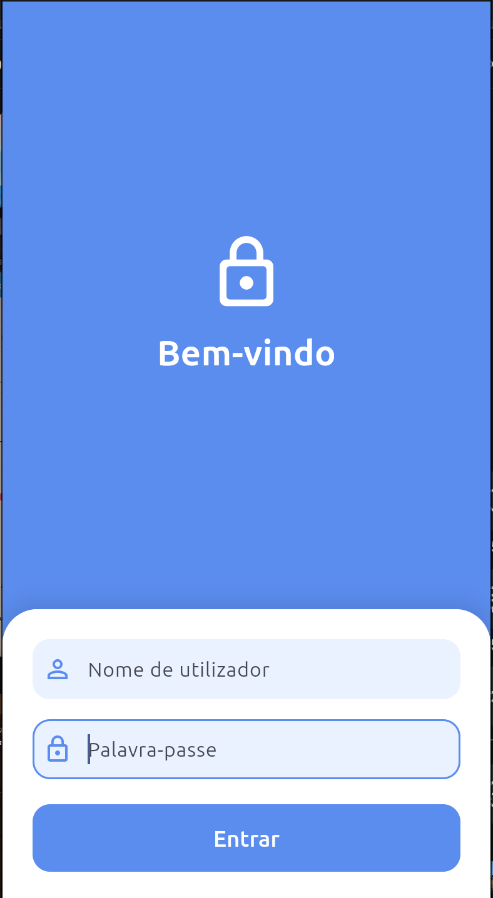

# Login Page

Uma tela de login simples desenvolvida com **Flutter**, como parte dos meus primeiros estudos em **Mobile Development**.

Este foi o meu primeiro projeto prático utilizando Flutter. A ideia não foi criar uma aplicação completa, mas começar a entender como o Flutter funciona e colocar em prática os primeiros conceitos aprendidos.

## Preview

  

## Sobre o projeto

O projeto começou a partir do template padrão do Flutter e foi sendo adaptado para criar uma tela de login simples e funcional.

Mesmo sendo um projeto pequeno, ele serviu para começar a entender a forma como o Flutter constrói interfaces através de widgets e como os diferentes elementos de uma aplicação são organizados.

## O que estou aprendendo

Durante o desenvolvimento deste projeto, comecei a estudar e praticar:

* Fundamentos de Dart
* Estrutura de um projeto Flutter
* Widgets
* `StatelessWidget` e `StatefulWidget`
* Composição de widgets
* Layout e alinhamento
* `Column`, `Row`, `Container` e `Padding`
* Campos de texto
* Formulários
* Botões e interações
* Estado básico
* Navegação entre telas

## Por que Flutter?

Venho de uma experiência principalmente voltada para desenvolvimento web, então o Flutter apresenta uma forma diferente de pensar na construção de interfaces.

Em vez de trabalhar com HTML, CSS e DOM, o Flutter utiliza uma abordagem baseada em widgets, onde a interface é construída através de uma árvore de componentes.

Este projeto representa o início da minha exploração desse ecossistema e da minha transição para o desenvolvimento de aplicações mobile.

## Próximos estudos

Este projeto é propositalmente simples. Ele representa apenas o início dos meus estudos com Flutter.

À medida que avanço, pretendo explorar conceitos como:

* Navegação e rotas
* Formulários e validação
* Gerenciamento de estado
* Consumo de APIs
* Autenticação
* Armazenamento local
* Arquitetura de aplicações
* Permissões
* Recursos nativos do Android
* Animações e gestos
* Acessibilidade
* Desenvolvimento de aplicações mobile completas

## Tecnologias

* Flutter
* Dart

## Status

Projeto de estudo — meu primeiro projeto com Flutter.

Este repositório serve também como um registro do meu ponto de partida e da minha evolução no desenvolvimento mobile.

## Recursos

* [Documentação do Flutter](https://docs.flutter.dev/)
* [Aprender Flutter](https://docs.flutter.dev/get-started/learn-flutter)
* [Primeira aplicação Flutter](https://docs.flutter.dev/get-started/codelab)
* [Recursos para aprender Flutter](https://docs.flutter.dev/reference/learning-resources)